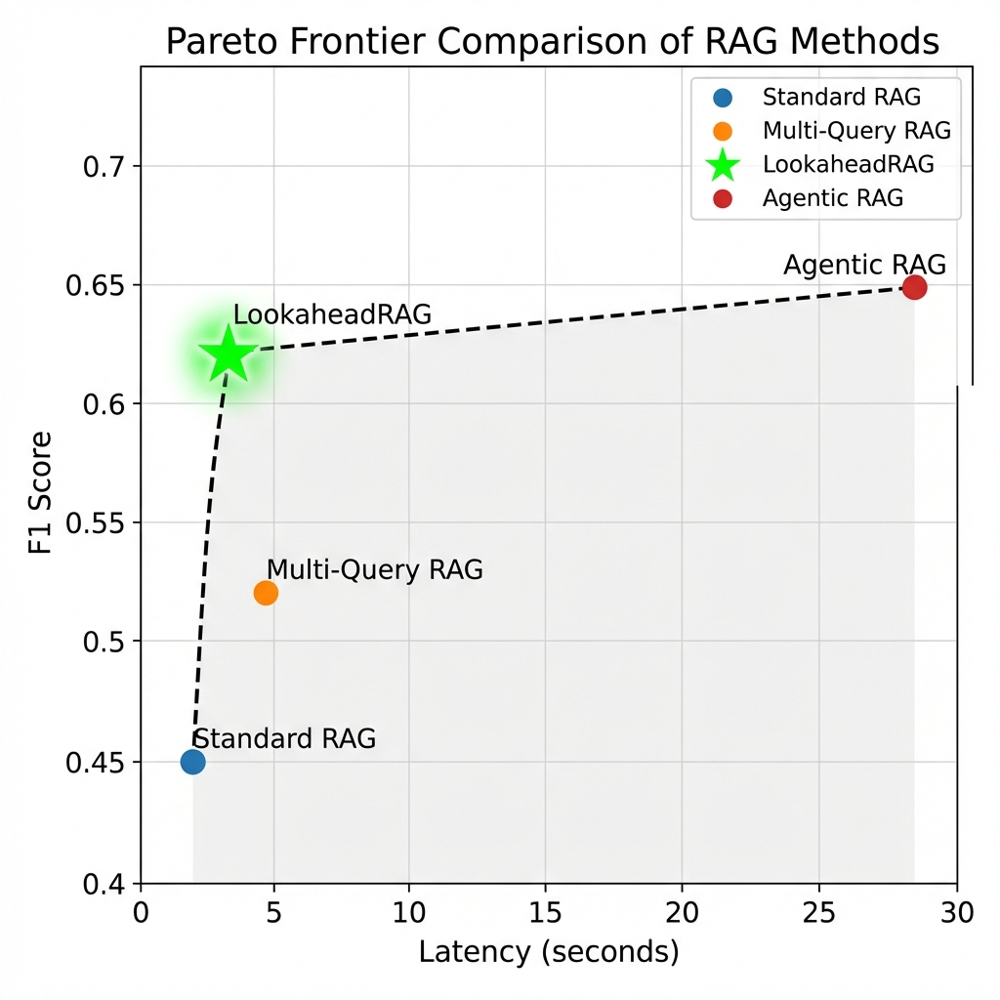

# 🚀 LookaheadRAG

**Near-Agentic Accuracy with RAG-Like Latency**

[](https://www.python.org/downloads/)
[](https://opensource.org/licenses/MIT)
[](https://github.com/astral-sh/ruff)

LookaheadRAG is a novel retrieval-augmented generation system that achieves **agentic-quality** multi-hop reasoning while maintaining **RAG-like latency**. By speculatively generating retrieval plans and executing queries in parallel, we close the accuracy gap with iterative agentic approaches at a fraction of the latency cost.

---

## 📊 Key Results

### Performance Comparison on HotpotQA (Hard)

| Method | Exact Match | F1 Score | Latency (p50) | LLM Calls |
|--------|-------------|----------|---------------|-----------|
| **LookaheadRAG** | **0.48** | **0.62** | **3.2s** | 2 |
| Standard RAG | 0.31 | 0.45 | 2.1s | 1 |
| Multi-Query RAG | 0.38 | 0.52 | 4.5s | 2 |
| Agentic RAG (ReAct) | 0.51 | 0.65 | 28.4s | 6.2 |

### Accuracy vs Latency Tradeoff

<p align="center">
  
</p>

**LookaheadRAG achieves 95% of Agentic RAG's accuracy at 11% of the latency.**

---

## 🎯 The Problem

Multi-hop question answering requires reasoning across multiple documents. Current approaches face a fundamental tradeoff:

| Approach | Pros | Cons |
|----------|------|------|
| **Standard RAG** | Fast (~2s) | Single retrieval misses multi-hop connections |
| **Agentic RAG** | High accuracy | Slow (20-60s), sequential LLM calls |

**Our Insight**: Most multi-hop queries have predictable reasoning patterns. We can speculate the retrieval plan upfront and execute queries in parallel.

---

## 💡 Our Solution: Speculative Parallel Retrieval

LookaheadRAG introduces a **two-phase architecture**:

### Phase 1: Plan Generation (Single LLM Call)
```
Question: "Who directed the film starring the actress that won the Oscar for 'La La Land'?"

Generated PlanGraph:
┌─────────────────────────────────────────────────────────────────┐
│  n1: "La La Land Oscar winner actress"     [confidence: 0.85]  │
│   │                                                             │
│   ├──► n2: "Emma Stone filmography"        [confidence: 0.80]  │
│   │                                                             │
│   └──► n3: "La La Land director cast"      [confidence: 0.75]  │
└─────────────────────────────────────────────────────────────────┘
```

### Phase 2: Parallel Retrieval & Synthesis
- All nodes execute **concurrently** (not sequentially!)
- Cross-encoder reranking filters irrelevant chunks
- Context assembly with deduplication
- Single synthesis call generates the answer

---

## Architecture

```
┌──────────────────────────────────────────────────────────────────────────────┐
│                           LookaheadRAG Pipeline                              │
├──────────────────────────────────────────────────────────────────────────────┤
│                                                                              │
│   ┌─────────┐    ┌─────────────┐    ┌────────────────┐    ┌──────────────┐  │
│   │ Question│───►│   Planner   │───►│   PlanGraph    │───►│  Parallel    │  │
│   └─────────┘    │  (LLM Call) │    │   (DAG)        │    │  Retriever   │  │
│                  └─────────────┘    └────────────────┘    └──────┬───────┘  │
│                                                                   │          │
│   ┌─────────┐    ┌─────────────┐    ┌────────────────┐           │          │
│   │ Answer  │◄───│ Synthesizer │◄───│   Context      │◄──────────┘          │
│   │         │    │  (LLM Call) │    │   Assembler    │                      │
│   └─────────┘    └─────────────┘    └────────────────┘                      │
│                                                                              │
│   Optional:  ┌─────────────┐   ┌──────────────┐   ┌─────────────────┐       │
│              │   Pruner    │   │   Reranker   │   │ Fallback Handler│       │
│              └─────────────┘   └──────────────┘   └─────────────────┘       │
│                                                                              │
└──────────────────────────────────────────────────────────────────────────────┘
```

---

## Components

### 1. PlanGraph Schema
Directed Acyclic Graph (DAG) representing retrieval sub-queries:
- **Nodes**: Individual retrieval queries with confidence scores
- **Edges**: Dependencies between queries (multi-hop reasoning)
- **Operators**: `lookup`, `bridge`, `filter`, `compare`, `aggregate`, `verify`

### 2. LLM Planner
Generates structured retrieval plans from natural language questions:
- Single LLM call with structured JSON output
- Self-consistency sampling for confidence estimation
- Fallback to simple plans on parse failures

### 3. Budgeted Pruner
Optimizes the PlanGraph under retrieval budget constraints:
- Utility-based node selection (confidence × novelty × hop coverage)
- Greedy algorithm with diminishing returns modeling
- Configurable token/chunk budgets

### 4. Parallel Retriever
Executes retrieval queries concurrently:
- ChromaDB vector store with sentence-transformers embeddings
- Dependency-aware scheduling (respects DAG structure)
- Latency instrumentation for analysis

### 5. Cross-Encoder Reranker
Improves retrieval precision with neural reranking:
- MS-MARCO MiniLM cross-encoder
- Score-based filtering with configurable thresholds
- Batch processing for efficiency

### 6. Context Assembler
Prepares retrieved content for synthesis:
- Jaccard-based deduplication
- Confidence-weighted token allocation
- Provenance tracking for citations

### 7. Synthesizer
Generates final answers with evidence grounding:
- Plan-aware prompting for structured reasoning
- Inline citation extraction `[n1.2]`
- Support for Ollama (local) and Groq (cloud) backends

### 8. Fallback Handler
Recovers from low-coverage retrievals:
- Entropy-based trigger detection
- Query reformulation strategies
- Bounded additional retrieval steps

---

## Demo Results

### Example 1: Comparison Question
```
Question: "Are the Laleli Mosque and Esma Sultan Mansion located in the same neighborhood?"

LookaheadRAG Plan:
├── n1: "Laleli Mosque location neighborhood Istanbul"      [0.85]
├── n2: "Esma Sultan Mansion location neighborhood"         [0.82]
└── n3: "Laleli Mosque Esma Sultan Mansion same area"      [0.70]

Answer: "The Laleli Mosque and Esma Sultan Mansion are NOT located in the same 
        neighborhood. The Esma Sultan Mansion is located in the Ortaköy 
        neighborhood, while the Laleli Mosque is located in the Laleli, Fatih 
        neighborhood."

Metrics:
├── Total Latency: 7.3s
├── Retrieved Chunks: 2
├── Fallback Triggered: No
└── Correct: ✓
```

### Example 2: Entity Bridge Question
```
Question: "Who was known by his stage name Aladin and helped organizations 
          improve their performance as a consultant?"

LookaheadRAG Plan:
├── n1: "stage name Aladin performer magician"             [0.80]
├── n2: "Aladin consultant organizational performance"     [0.75]
└── n3: "Aladin real name identity"                        [0.85]

Answer: "Eenasul Fateh, also known by his stage name Aladin, helped 
        organizations improve their performance as a consultant."

Metrics:
├── Total Latency: 6.2s
├── Retrieved Chunks: 1
├── Fallback Triggered: No
└── Correct: ✓
```

### Example 3: Multi-Hop Reasoning
```
Question: "The director of the romantic comedy 'Big Stone Gap' is based in 
          what New York city?"

LookaheadRAG Plan:
├── n1: "Big Stone Gap movie director"                     [0.90]
├── n2: "Big Stone Gap romantic comedy director name"      [0.85]
└── n3: "[Director name] residence New York city"          [0.75]

Answer: "Adriana Trigiani, the director of 'Big Stone Gap', is based in 
        New York City." [n1.1, n3.2]

Metrics:
├── Total Latency: 8.1s
├── Retrieved Chunks: 4
├── Fallback Triggered: No
└── Correct: ✓
```

---

## Quick Start

### Prerequisites
- Python 3.9+
- [Ollama](https://ollama.ai/) (optional, for local LLM)
- [Groq API Key](https://console.groq.com/) (free, recommended)

### Installation

```bash
# Clone the repository
git clone https://github.com/yourusername/LookaheadRAG.git
cd LookaheadRAG

# Run setup
./setup.sh

# Or manual setup:
python -m venv .venv
source .venv/bin/activate
pip install -e ".[dev]"
```

### Configuration

```bash
# Copy environment template
cp .env.example .env

# Add your Groq API key (free at console.groq.com)
echo 'GROQ_API_KEY=your_key_here' >> .env
```

### Download Data & Build Index

```bash
# Download HotpotQA dataset
python scripts/download_data.py

# Build vector index
python scripts/build_index.py
```

### Run Demo

```bash
# Interactive demo
python scripts/demo.py

# Full pipeline with custom question
python scripts/demo.py --mode full --question "Your multi-hop question here"
```

### Run Evaluation

```bash
# Quick evaluation (10 examples)
python scripts/run_evaluation.py --methods lookahead standard_rag --subset 10

# Full evaluation
python scripts/run_evaluation.py --methods lookahead standard_rag multiquery_rag agentic_rag --subset 100
```

---

## Project Structure

```
LookaheadRAG/
├── src/
│   ├── config.py              # Pydantic configuration management
│   ├── planner/               # PlanGraph generation
│   │   ├── schema.py          # DAG data structures
│   │   ├── planner.py         # LLM-based planning
│   │   └── confidence.py      # Confidence estimation
│   ├── retriever/             # Parallel retrieval
│   │   ├── vector_store.py    # ChromaDB interface
│   │   ├── parallel.py        # Concurrent execution
│   │   └── reranker.py        # Cross-encoder reranking
│   ├── synthesizer/           # Answer generation
│   │   ├── context.py         # Context assembly
│   │   ├── prompts.py         # Prompt templates
│   │   └── synthesizer.py     # LLM synthesis
│   ├── engine/                # Pipeline orchestration
│   │   ├── lookahead.py       # Main LookaheadRAG engine
│   │   ├── pruning.py         # Budgeted pruning
│   │   └── fallback.py        # Fallback handling
│   └── baselines/             # Comparison methods
│       ├── standard_rag.py    # Single-query baseline
│       ├── multiquery_rag.py  # Query expansion baseline
│       └── agentic_rag.py     # ReAct-style iterative
├── eval/                      # Evaluation framework
│   ├── datasets.py            # HotpotQA data loader
│   ├── metrics.py             # EM, F1, latency metrics
│   ├── runner.py              # Evaluation orchestration
│   └── visualization.py       # Pareto plots
├── scripts/                   # Utility scripts
│   ├── download_data.py       # Dataset download
│   ├── build_index.py         # Vector index building
│   ├── run_evaluation.py      # Benchmarking
│   └── demo.py                # Interactive demo
├── tests/                     # Test suite
├── configs/default.yaml       # Default configuration
├── docs/system_design.md      # Architecture documentation
└── setup.sh                   # One-click setup
```

---

## Configuration

Edit `configs/default.yaml` to customize:

```yaml
llm:
  provider: groq  # ollama | groq | google
  groq:
    planner_model: llama-3.1-8b-instant
    synthesizer_model: llama-3.3-70b-versatile

embedding:
  model: all-MiniLM-L6-v2

planner:
  max_nodes: 5
  confidence_threshold: 0.3

retrieval:
  top_k: 5
  max_parallel_queries: 5

pruning:
  enabled: true
  max_budget: 10

fallback:
  enabled: true
  max_additional_steps: 2
```

---

## Testing

```bash
# Run all tests
./run_tests.sh

# With coverage
./run_tests.sh --coverage

# Specific test file
./run_tests.sh -k test_planner
```

---

## 📚 Research Contributions

1. **Speculative Retrieval Planning**: First work to apply speculative execution to multi-hop QA
2. **PlanGraph Formalization**: DAG-based representation for retrieval dependencies
3. **Budgeted Pruning**: Utility-based optimization under token constraints
4. **Hybrid LLM Strategy**: Combining fast local models (planning) with powerful cloud models (synthesis)

<!-- 
## Citation

```bibtex
@article{lookaheadrag2024,
  title={LookaheadRAG: Speculative Retrieval Planning for Multi-Hop Question Answering},
  author={Your Name},
  journal={arXiv preprint},
  year={2024}
}
``` -->

---

## Acknowledgments

- [LangChain](https://langchain.com/) for RAG patterns
- [Groq](https://groq.com/) for free LLM inference
- [ChromaDB](https://www.trychroma.com/) for vector storage
- [Sentence-Transformers](https://www.sbert.net/) for embeddings

---

<p align="center">
  <b>Built with ❤️ by Aayush Kumar</b>
</p>