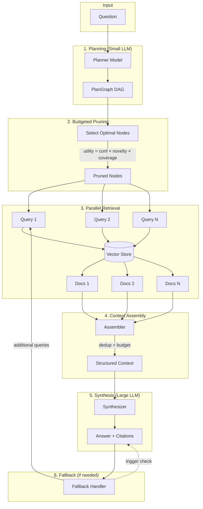
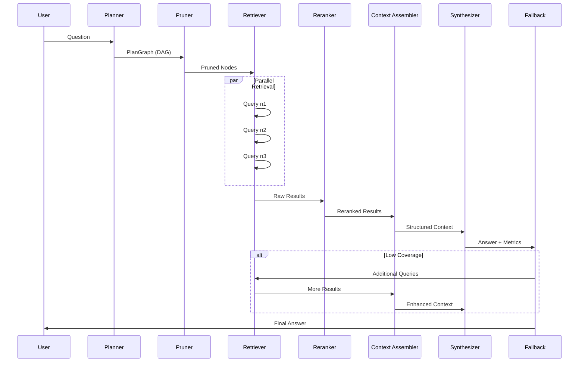
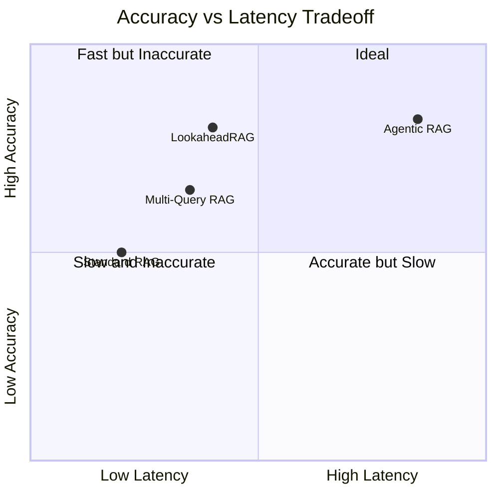

# LookaheadRAG System Design

## Overview

LookaheadRAG is a novel retrieval-augmented generation system that achieves near-agentic accuracy with RAG-like latency through **speculative retrieval planning**.

**Key Insight:** Separate *planning* from *reasoning*. Use a small planner model to predict a retrieval dependency graph (DAG) upfront, then execute parallel retrieval and one-shot synthesis.

## Architecture



## Core Components

### 1. PlanGraph Schema

The PlanGraph is a **Directed Acyclic Graph (DAG)** where nodes represent retrieval sub-queries.

```json
{
  "question": "Who wrote the novel featuring Sherlock Holmes?",
  "nodes": [
    {
      "id": "n1",
      "query": "Sherlock Holmes novel author",
      "op": "lookup",
      "depends_on": [],
      "confidence": 0.85,
      "budget_cost": 1
    },
    {
      "id": "n2", 
      "query": "Arthur Conan Doyle biography",
      "op": "lookup",
      "depends_on": ["n1"],
      "confidence": 0.75,
      "budget_cost": 1
    }
  ]
}
```

**Operators:**
| Operator | Description | Use Case |
|----------|-------------|----------|
| `lookup` | Entity/property fetch | "Who is X?" |
| `bridge` | Find connecting relation | "How are X and Y related?" |
| `filter` | Apply constraints | "X after 1990" |
| `compare` | A vs B comparison | "Which is larger?" |
| `aggregate` | Count/list | "How many X?" |
| `verify` | Support/refute | Fact checking |

### 2. Planner Model

**Architecture:** Small LLM (Llama 3.2 3B or similar)

**Input:** Question  
**Output:** PlanGraph JSON

**Key Features:**
- Structured output with JSON mode
- Confidence estimation via self-consistency
- 2-5 diverse sub-queries per question

### 3. Parallel Retriever

**Execution Strategy:**
1. Topologically sort nodes by dependencies
2. Execute independent nodes in parallel
3. Wait for dependencies before dependent nodes
4. Aggregate results with provenance tracking

**Latency Benefit:**
```
Sequential: t₁ + t₂ + t₃ + ... + tₙ
Parallel:   max(t₁, t₂, ..., tₙ) + sync_overhead
```

### 4. Budgeted Pruning

**Utility Function:**
```
utility(node) = w₁·confidence + w₂·novelty + w₃·hop_coverage
```

**Algorithm:** Greedy selection subject to `Σ budget_cost ≤ B`

**Weights (configurable):**
- Confidence: 0.4
- Novelty: 0.3  
- Hop Coverage: 0.3

### 5. Context Assembler

**Responsibilities:**
1. **Deduplication:** Remove duplicate/similar chunks
2. **Token Budgeting:** Allocate budget proportional to confidence
3. **Provenance Tracking:** Map `node_id → document_ids`
4. **Compression:** Extractive summarization for low-priority evidence

### 6. Synthesizer

**Prompt Structure:**
```
[System] You are a precise QA assistant...

[User]
## Question
{question}

## Evidence
[n1.1] First chunk from node 1
[n1.2] Second chunk from node 1
[n2.1] First chunk from node 2

Answer with citations [node.chunk]:
```

**Output:** Answer with inline citations `[n1.2]`

### 7. Fallback Handler

**Triggers:**
- Low retrieval coverage (< threshold chunks)
- High planner entropy
- Failed nodes

**Policy:** Bounded ≤2 additional steps

## Data Flow



## Latency Analysis

| Stage | Typical Latency | Notes |
|-------|-----------------|-------|
| Planning | 200-500ms | Small model, single call |
| Pruning | <10ms | CPU-only computation |
| Retrieval | 50-200ms | Parallel, dominated by slowest |
| Reranking | 50-100ms | Cross-encoder, batched |
| Assembly | <10ms | CPU-only |
| Synthesis | 500-2000ms | Large model, single call |
| **Total** | **800-2800ms** | vs 5-15s for agentic |

## Comparison with Baselines



## Configuration

Key configuration parameters in `configs/default.yaml`:

```yaml
planner:
  max_nodes: 5
  confidence_threshold: 0.3
  
pruning:
  max_budget: 10
  utility_weights:
    confidence: 0.4
    novelty: 0.3
    hop_coverage: 0.3

retrieval:
  top_k: 5
  max_parallel_queries: 5

fallback:
  triggers:
    low_coverage_threshold: 2
    high_entropy_threshold: 1.5
  max_additional_steps: 2
```

## Research Contributions

1. **Speculative Retrieval Planning Task:** Formal definition of Question → PlanGraph

2. **Budgeted Graph Pruning:** Principled latency/accuracy tradeoff via utility optimization

3. **Parallel DAG Execution:** Exploit plan structure for concurrent retrieval

4. **Robust Fallback:** Controlled degradation with bounded additional steps

5. **Evaluation Framework:** Accuracy-latency Pareto frontiers for fair comparison

## Future Directions

- **Plan Learning:** Train dedicated planner on distilled plans
- **Adaptive Budgeting:** Dynamic budget based on question complexity
- **Caching:** Cache frequent sub-query results
- **Streaming:** Stream synthesis as context arrives
